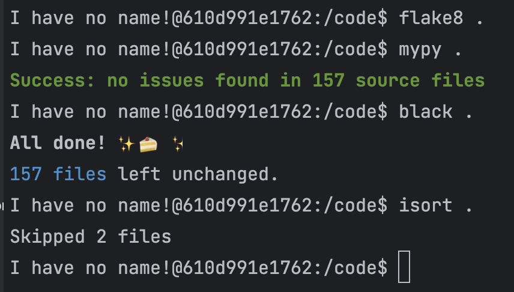

## 15. Онлайн платформа для заказа еды с использованием Fast Api
- Модели: Пользователи, Рестораны, Заказы
- Идея проекта: Разработка онлайн платформы для заказа еды с возможностью просмотра меню, выбора блюд, оформления заказов и авторизации пользователей.

Требования к проекту:
- Упаковка проекта в докер-компоуз и запуск через docker compose up без дополнительной настройки
- прохождение flake8 + mypy в соответствии с конфигурациями проекта
- Кеширование всего, что возможно закешировать через redis
- Orm:  sqlalchemy2.0
- Migration: alembic
- Тесты - pytest + mock на redis и rollback транзакций фикстур вместо удаления.
- Минимальные данные при разворачивании проекта (фикстуры)
- Метрики: 
  - На кол-во полученных запросов в разрезе каждой ручки.
  - На кол-во ошибок по каждой ручке
  - На кол-во отправленных запросов
  - Время выполнения каждой ручки в среднем (гистограмма)
  - Время выполнения всех интеграционных методов (запросы в бд, редис и тп (гистограмма)
- Валидация входящих данных (pydantic)
- Настройки в env
- Без дублирования кода
- poetry как сборщик пакетов
- Обработка ошибок и соответствующие статусы ответов
-В README.md ожидается увидеть как что работает, чтобы можно было ознакомиться проще с проектом

 ## Сделано:
- Модели: User, Restaurant, Order, Product, OrderProduct
- Фикстуры: Минимальные данные для вышеизложенных таблиц

- Базовый crud на модели и тесты к ним
- Метрики
- Flake8 и MyPy

- Дополнительные ручки на поиск рестранов и продуктов и тесты к ним

#### Примеры запросов
Представлены в ссылке ниже, необходимо импортировать в Postman

[Cкачать примеры запросов](./readme/ex_req.json)
